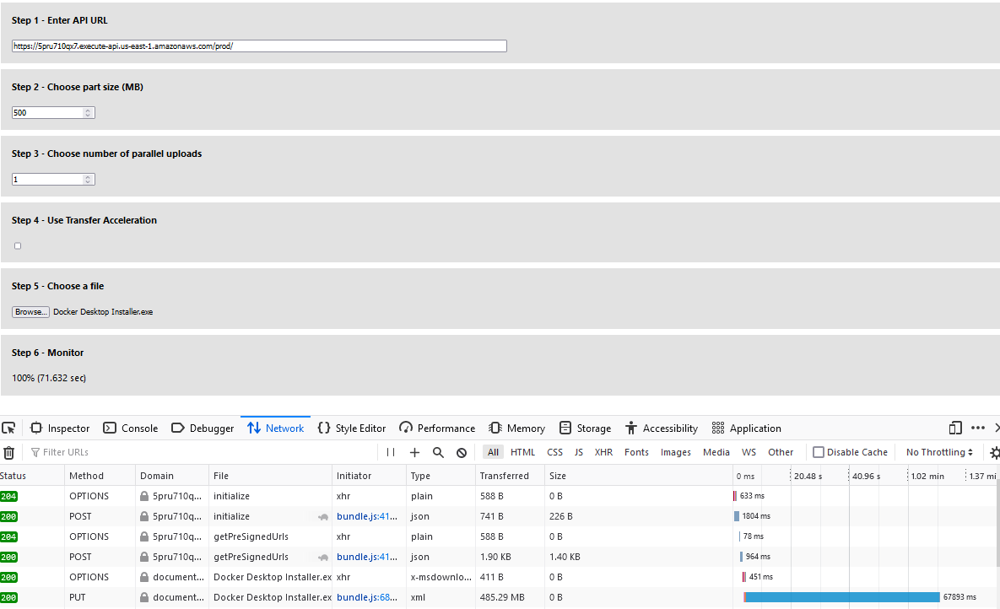
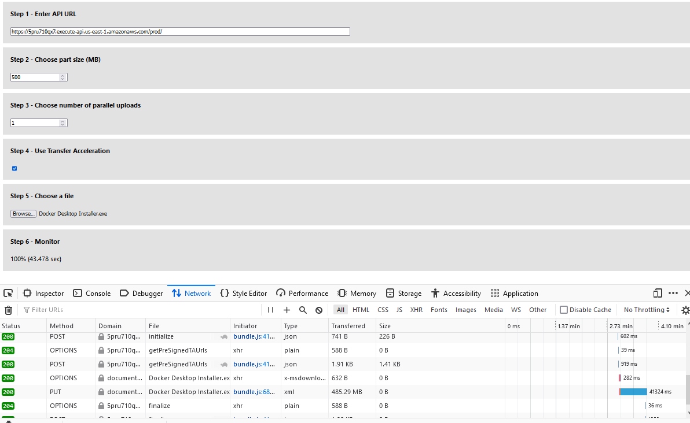
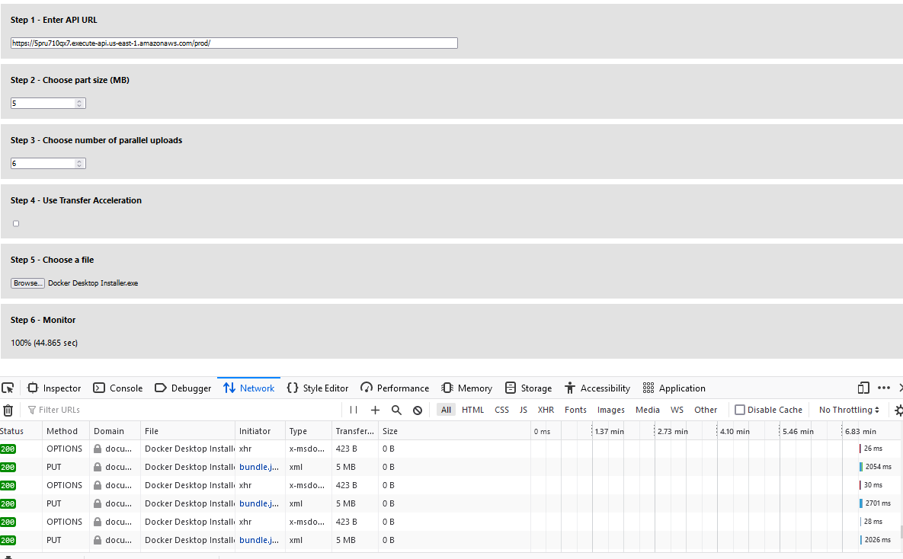
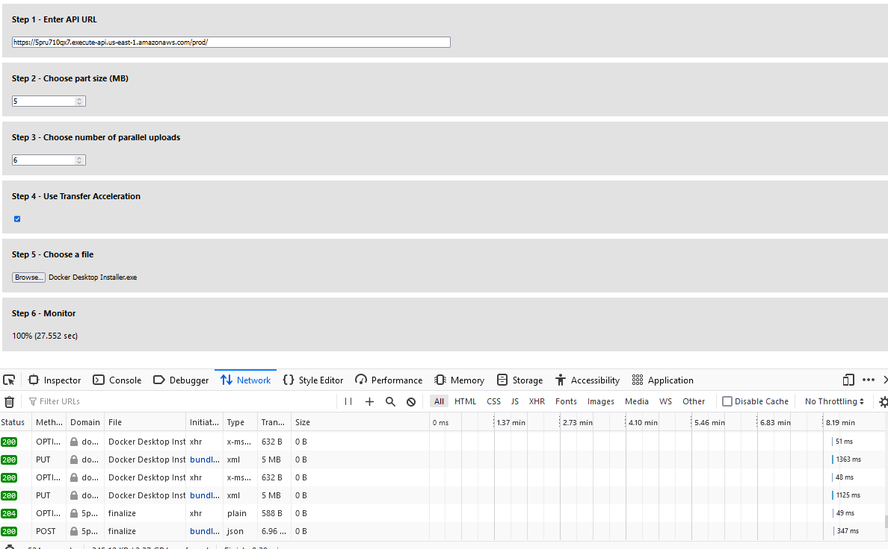

Este proyecto prototipo tiene como objetivo mostrar una manera de implementar la carga multipartita y la aceleración de transferencia directamente desde el navegador usando URLs firmadas previamente.

## Despliegue de la aplicación
### Prerrequisito
Antes de comenzar, es necesario preparar el ambiente de trabajo con las siguientes herramientas:
- AWS CLI: Esencial para interactuar con los servicios de AWS desde la línea de comando. Debe estar correctamente instalado y configurado con tus credenciales de AWS.
- AWS CDK: Herramienta de desarrollo para definir la infraestructura de nube en código y desplegarla a través de AWS CloudFormation. Su instalación es crucial para el despliegue del backend.
- Docker: Se utiliza para contenerizar y ejecutar aplicaciones, asegúrate de tenerlo instalado y corriendo en tu sistema.

### Backend

Para preparar y desplegar el backend del proyecto, sigue estos pasos desde la terminal:
1. Navega hasta la carpeta `backendv2` del proyecto y ejecuta `npm install` para instalar todas las dependencias necesarias. Es recomendable usar `npm audit` para verificar si hay vulnerabilidades conocidas en los paquetes dependientes.
2. Usa `cdk bootstrap aws://numero-cuenta/region` para preparar el entorno de AWS CDK. Es crucial que la región y el número de cuenta especificados aquí coincidan con los que planeas usar para el despliegue.
3. En el archivo `bin/multipart_s3_upload.ts`, asegúrate de especificar la misma región y cuenta que usaste en el paso anterior. Esto garantiza la coherencia en el entorno de despliegue.
4. Realiza el despliegue con el comando `cdk deploy --context env="randnumber" --context whitelistip="ip"` (puedes usar https://www.cual-es-mi-ip.net/ para saber tu IP). Es importante notar que en el archivo `lib/multipart_s3_upload-stacks.ts`, línea `18`, el nombre del bucket debe ser único para evitar conflictos con otros buckets existentes.

- Tome nota de la URL del punto final de stage de la API Gateway.

### Frontend
- Desde la carpeta frontend, ejecute "npm install" para instalar los paquetes.
- Opcionalmente, puede ejecutar "npm audit --production" para verificar las vulnerabilidades.
- Ejecute "npm run start" para lanzar la aplicación frontend desde el navegador.
- Utilice la interfaz de usuario mostrada en el navegador.
- Para el Paso 1, ingrese la URL del punto final de API Gateway.
- Para el Paso 2 y Paso 3, elija un número base. Utilice su ancho de banda disponible, tamaño de ventana TCP y requisitos de tiempo de reintentos para determinar el tamaño óptimo de la parte. Esto necesita ser un mínimo de 5 MB. Los navegadores web tienen un límite en el número de conexiones concurrentes al mismo servidor. En Firefox, el predeterminado es de 6 conexiones. Especificar un mayor número de conexiones concurrentes resultará en un bloqueo en el lado del navegador web.
- Para el Paso 4, elija si usar o no la característica de aceleración de transferencia.
- Para el Paso 5, elija un archivo grande para subir.
- La parte final de la interfaz de usuario mostrará el progreso de la subida y el tiempo para subir el archivo a S3.

## Mejora del rendimiento – Puede subir partes en paralelo para mejorar el rendimiento
En esta sección, se utilizará un archivo de muestra "Docker Desktop Installer.exe" (485MB) para probar la mejora del rendimiento. La aplicación web y el bucket de S3 están en la región del Este de EE.UU. La prueba de velocidad de internet en el cliente del navegador web mostró que el cliente puede subir a 79 Megabits por segundo. A continuación, se muestran los resultados de subir el archivo de muestra como una sola parte, una sola parte con aceleración de transferencia, múltiples partes y múltiples partes con aceleración de transferencia, respectivamente.

### Prueba 1: Subida de una sola parte (72 segundos)

### Prueba 2: Subida de una sola parte con aceleración de transferencia (43 segundos)

### Prueba 3: Subida de múltiples partes (45 segundos)

### Prueba 4: Subida de múltiples partes con aceleración de transferencia (28 segundos)

## Recuperación rápida de cualquier problema de red – El tamaño de parte más pequeño minimiza el impacto de reiniciar una subida fallida debido a un error de red
### Test 5: Recuperación de un problema de red simulado
Un problema de red se simula activando el modo "Trabajar sin conexión" de Firefox mientras está en progreso una subida de múltiples partes con aceleración de transferencia. Como se muestra a continuación, la aplicación web del lado del cliente esperará un cierto período de tiempo antes de reintentar el proceso de subida. Cuando el navegador se conecta en línea desactivando "Trabajar sin conexión", las partes que no se subieron se cargarán automáticamente. Esta característica minimizó el impacto de reiniciar una subida fallida debido a un problema de red transitorio.

## Recomendación
Como se ve en los resultados, subir un archivo grande utilizando la característica de subida de múltiples partes de S3 y la aceleración de transferencia puede acelerar el tiempo de proceso de subida en un 61% ((72-28/72)*100). Esto es posible mejorando el rendimiento con la subida de múltiples partes y reduciendo la latencia con la aceleración de transferencia. Al subir partes más pequeñas en el lado del cliente y utilizar una estrategia de reintentos de retroceso exponencial para las subidas fallidas &#8203;``【oaicite:0】``&#8203;

## Créditos
Este proyecto está inspirado en una publicación de blog de LogRocket, pero utiliza servicios serverless de AWS para implementar el backend. El frontend ha sido reconstruido desde cero con mejoras para utilizar la aceleración de transferencia y mejorar la usabilidad.

**Nota Importante:** Al finalizar y querer eliminar los recursos desplegados con el comando `cdk destroy`, puede surgir un error si el bucket S3 no está vacío. Asegúrate de vaciar el bucket S3 antes de ejecutar este comando para evitar problemas.